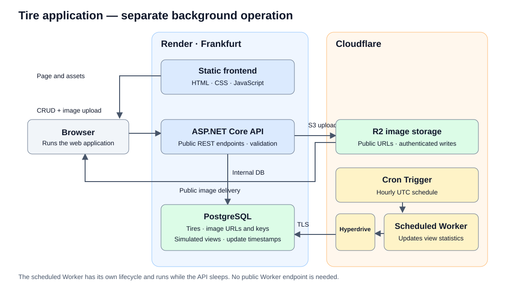
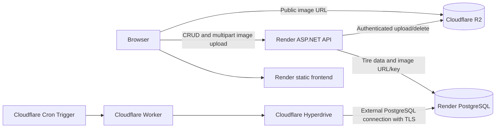

# cloud-computing-ex3

## Live application

- [Web application](https://cloud-computing-ex3-web.onrender.com)
- [Public API: list tires](https://cloud-computing-ex3-api.onrender.com/tires)

## Exercise

Make an application with CRUD (Create, Read, Update Delete + list data) functionality of any kind of entities on any PaaS. Create and update functions should check input of at least 4 different data types. Application should contain web application, public API, database for persistence, file storage and some background operation. Make a small architectural drawing.

## Tech Stack

| Area | Technology |
| --- | --- |
| Backend language | C# + ASP.NET Core Web API |
| ORM | Entity Framework Core |
| Database | PostgreSQL |
| Frontend | HTML/CSS/JavaScript |

## Running locally

1. Start PostgreSQL (from the repository root):

   ```
   docker compose up -d
   ```

   PostgreSQL 17 listens on `localhost:5433`. Host port 5433 is used so a PostgreSQL
   already installed on 5432 is left untouched. Data lives in the `tires-db-data` volume
   and survives `docker compose down` (`docker compose down -v` wipes it).

2. Start the API (from the `api` folder):

   ```
   dotnet run --launch-profile http
   ```

   It applies pending migrations on start-up and listens on `http://localhost:5016`.

3. Open `frontend/index.html` in a browser, or serve the `frontend` folder with a static file server.

   The page selects the local API on localhost or when opened as a file. For other
   hosts, it uses the deployed URL configured in `frontend/app.js`.

## API

| Action | HTTP call |
| --- | --- |
| List tires | `GET /tires` |
| Get a tire | `GET /tires/{id}` |
| Create tire | `POST /tires` |
| Update tire | `PUT /tires/{id}` |
| Delete tire | `DELETE /tires/{id}` |

Create and update accept JSON with an image URL or multipart form data with an uploaded image, and validate brand, tire type, rim diameter, and price in
`api/TireValidator.cs`. Image uploads validate file size and JPEG/PNG/WebP signatures in
`api/ImageUpload.cs`. The frontend displays validation errors under the form.
Example requests are in `api/api.http`; interactive API documentation is available
at `/scalar` when running in Development.

### Demonstrating with Insomnia

After deploying this version of the API, create a request with method **POST** and URL
`https://cloud-computing-ex3-api.onrender.com/tires` (or `http://localhost:5016/tires` locally).
Choose **Body → JSON** so Insomnia sends `Content-Type: application/json`, and paste:

```json
{
  "brand": "Michelin",
  "type": "AllSeason",
  "rimDiameter": 17,
  "price": 129.99,
  "imageUrl": "https://example.com/tire.jpg"
}
```

Replace `imageUrl` with a real public image link. HTTP and HTTPS URLs are accepted,
including links with query strings or without a file extension. The API stores the
link without downloading it to R2. A successful POST returns **201 Created** and
the tire's ID. Use that ID for GET, PUT, and DELETE at `/tires/{id}`. PUT accepts the
same JSON; omit `imageUrl` to retain the current image. Invalid fields return **400**.
To demonstrate R2 storage, choose **Multipart Form** instead, add the four tire
fields as text, and add `image` as a file. Let Insomnia set the multipart header.

## Database

PostgreSQL through EF Core (`Npgsql.EntityFrameworkCore.PostgreSQL`). The API reads the
connection string from the `ConnectionStrings:Default` configuration key, so the same
build works locally and on Render — only the value differs:

| Environment | Where the value comes from |
| --- | --- |
| Local | `api/appsettings.Development.json` (`Host=localhost;Port=5433;Database=tires;...`) |
| Render | Environment variable `ConnectionStrings__Default` |

`__` is how .NET represents `:` in environment variable names, so
`ConnectionStrings__Default` maps to `ConnectionStrings:Default`.

The API accepts both Npgsql keyword connection strings and `postgres://` or
`postgresql://` URLs. `api/DatabaseConnection.cs` converts URLs before passing them
to Npgsql, including decoding credentials, defaulting the port to 5432, and honoring
an optional `sslmode` query parameter. Other URL query parameters are rejected.

Run the connection-format checks with `dotnet run --project tests/ConnectionChecks`.

### Migrations

Migrations live in `api/Migrations` and are applied automatically at start-up
(`Database.MigrateAsync()` in `api/Program.cs`), so a fresh database needs no manual
step. After changing `Tire` or `ApiDb`:

```
cd api
dotnet ef migrations add <Name>
```

The EF tools build the project and use the `Development` environment by default, so
`appsettings.Development.json` is picked up without extra configuration.

## Deploying to Render

`render.yaml` is a Render Blueprint that defines the Render frontend, API, and database.
Apply the Blueprint after pushing the repository, and configure the Cloudflare R2
bucket and API credentials separately as described below:

| Resource | Type | Plan |
| --- | --- | --- |
| `cloud-computing-ex3-db` | PostgreSQL | free |
| `cloud-computing-ex3-api` | Web service (Docker) | free |
| `cloud-computing-ex3-web` | Static site | free |

1. Push the repository to GitHub.
2. In the Render Dashboard choose **New → Blueprint**, select the repository, and apply.
3. Render creates all three resources and wires the API's `ConnectionStrings__Default`
   to the database's internal URL. The API applies migrations on its first start.

Worth knowing:

- The API and the database are both in `frankfurt`. An internal URL only resolves inside
  one region, so keep those two regions equal.
- Render has no native .NET runtime, so the API is built from `api/Dockerfile`, which
  listens on `0.0.0.0:$PORT` as Render requires.
- The page calls whatever URL is in `API_BASE` at the top of `frontend/app.js`. Service
  names are unique per workspace: if `cloud-computing-ex3-api` is already taken, Render
  appends a suffix and the URL changes — update `API_BASE` to match.
- Free plan limits: the database is **deleted 30 days after creation**, a free web
  service **spins down after 15 minutes** without traffic (~1 minute to wake), and
  Background Workers and Cron Jobs have no free tier.

### Wiring it by hand instead

1. Create the database with **New → Postgres**, then pick a region.
2. Render exposes two URLs:

   | | Reachable from | Use for |
   | --- | --- | --- |
   | Internal URL | Render services in the **same region** | The deployed API |
   | External URL | Anything on the internet, over TLS | A local API pointed at the cloud DB |

3. Set `ConnectionStrings__Default` on the API service (**Environment** page) to the
   **internal** URL.

Paste Render's PostgreSQL URL directly into the environment variable; the API
converts it to Npgsql's keyword format. For an external connection, use
`?sslmode=require` to require TLS. You can also supply the keyword form:

```
Host=<host>;Port=5432;Database=<database>;Username=<user>;Password=<password>;SSL Mode=Require
```

A Free Postgres instance holds 1 GB and has no backups. `fromDatabase` with
`property: connectionString` (as used in `render.yaml`) yields the internal URL.

## Background operation

The background operation is a **separately hosted Cloudflare Worker** in
`worker/`. Cloudflare invokes it hourly using a Cron Trigger. It connects directly
to Render PostgreSQL through Hyperdrive and replaces each tire's simulated
last-hour views with a random integer from 0 to 50 plus a UTC update timestamp.
It runs independently of the API, including while the free API sleeps.

These are demo statistics, not actual visitor tracking or a rolling one-hour
measurement. New tires show **Pending update** until the next scheduled run.
The frontend shows persisted statistics when refreshed.

Follow [the Cloudflare worker deployment guide](worker/README.md) to create
Hyperdrive, set its configuration ID, and deploy the worker. The Render Blueprint
creates only the Render resources; it does not deploy the Cloudflare Worker.
The API still owns database migrations. No new schema migration is needed.
For a one-minute demo, change the worker's cron schedule and redeploy as described
in the guide. The old API `TireViews__IntervalMinutes` setting is no longer used.

## File storage: Cloudflare R2

Images are uploaded by the API to R2 Standard storage. PostgreSQL stores the public
`ImageUrl` and an internal `ImageKey` for cleanup. Browser credentials are never
needed: the browser sends multipart form data to Render, and the API uploads to R2
using its S3-compatible API. R2 storage itself requires no compute service; the separate views Worker is unrelated to image uploads.
The Render Blueprint only configures the API; it does not create Cloudflare resources.

### One-time Cloudflare setup

1. In the Cloudflare dashboard, activate **R2 Object Storage**. Complete any billing
   activation requested by Cloudflare. Standard storage has a monthly free allowance;
   usage above that allowance is billable. See [R2 pricing](https://developers.cloudflare.com/r2/pricing/).
2. Create a bucket named `tire-images`, using **Standard** storage. You can choose an
   EU jurisdiction; use the S3 endpoint shown by Cloudflare for your chosen bucket.
3. Open the bucket's **Settings**, enable **Public Development URL**, and copy the
   `https://pub-....r2.dev` URL. This makes the uploaded demo images publicly readable.
   The supplied URL is rate-limited and intended for development. For production,
   connect a custom domain instead. See [public bucket setup](https://developers.cloudflare.com/r2/buckets/public-buckets/).
4. From R2's API-token management, create an **Object Read & Write** token scoped
   only to `tire-images`. Save the generated **Access Key ID**, **Secret Access Key**,
   and **S3 endpoint**. Use those S3 credentials, not the Cloudflare management token.
   See [R2 API tokens](https://developers.cloudflare.com/r2/api/tokens/).

Bucket writes stay authenticated. No bucket CORS configuration is needed for this
flow because uploads go through the API and the frontend displays images with ``.

### Configure Render

On the existing **API service**, open **Environment** and add all five variables:

| Variable | Value |
| --- | --- |
| `R2__Endpoint` | S3 endpoint copied from Cloudflare (usually `https://<account-id>.r2.cloudflarestorage.com`; EU buckets may differ) |
| `R2__BucketName` | `tire-images` |
| `R2__PublicBaseUrl` | Public `https://pub-....r2.dev` URL, or your custom image domain |
| `R2__AccessKeyId` | Generated Access Key ID |
| `R2__SecretAccessKey` | Generated Secret Access Key |

Save the environment settings and redeploy the API and static site with this code.
The database migration runs automatically. For a new Blueprint, `render.yaml`
provides the bucket name and prompts for the other values via `sync: false`.
Do not place credentials in the frontend, repository, or README.
Without valid storage configuration, uploads return HTTP 503 with an explanatory
message; listing and editing a tire without replacing its image still work.

For local development, set these same environment variables in the terminal before
running `dotnet run --launch-profile http` from `api`. Use a separate demo bucket
if you want to keep local and deployed uploads apart.

### Upload behavior and verification

The API allows 100 POST/PUT requests combined per 24-hour window, shared by all
callers. Excess requests return HTTP 429 before reading the upload or contacting
R2. Invalid requests and edits without an image also count. The allowance is held
in memory and resets on API restart/redeploy; multiple API instances each have
their own allowance. This limits demo abuse but is not a persistent billing cap.
Each accepted image is still limited to 5 MiB.

To disable create/update requests between demos, set `Uploads__Enabled` to `false`
in the Render API service's Environment settings and redeploy. Remove it or set it
to `true` for the demo. Reads and deletes remain available. The API is public, so
other people can still edit/delete demo data or consume the shared allowance.

- `POST /tires`: send JSON fields `brand`, `type`, `rimDiameter`, `price`, and
  `imageUrl`, or multipart fields with an `image` file.
- `PUT /tires/{id}`: the same four fields are required; omit `image` to keep the
  current image, or supply a file to replace it. JSON updates can supply a new
  `imageUrl` or omit it to keep the current image. Upload URLs are generated by the API.
- Files must be nonempty JPEG, PNG, or WebP, at most 5 MiB. The API checks magic bytes,
  not just the filename or browser-supplied content type. It does not fully decode
  images. The overall HTTP request limit is 6 MiB, including multipart overhead.
- Each image gets a unique key. After a successful replacement or deletion, the API
  attempts to remove the old object. A failed database save attempts to remove the
  new object. Cleanup errors are logged; failed cleanup can leave an orphan requiring
  manual deletion from R2. Database and object storage are not one atomic transaction.
- Existing external image links remain valid and are never deleted from their provider.

Run validation checks with `dotnet run --project tests/UploadChecks`.
Run frontend upload checks with `node tests/UploadChecks/frontend-checks.cjs`.
After configuring R2, use the page to create a tire with an image, refresh to check
persistence, edit without a file, replace the image, and delete the tire. Check the
bucket to confirm replacement/deletion cleanup. Try a file above 5 MiB and a text
file renamed `.png` to confirm rejection. Your current public CRUD API also permits
public uploads; access control would be needed before opening it beyond the demo.

## Architecture



See [the detailed architecture and explanation](docs/architecture.md).


## To-Do
- [x] Create API
- [x] Create frontend
- [x] Save data in DB
- [x] Save files in file storage (R2 integration; configure the bucket before deployment)
- [x] Implement a separate Cloudflare background worker (deploy using worker/README.md)
- [x] Make data validation in create and put operations (string, enum, int, decimal, plus image validation)
- [x] Host app on PaaS
- [x] Make architectural drawing

## Links

Render - https://dashboard.render.com/
CloudFlare - https://dash.cloudflare.com/