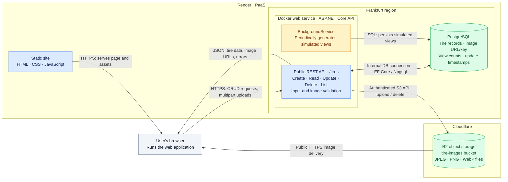

# Tire application — cloud architecture draft

This drawing follows the repository's code and `render.yaml`; it does not verify the live deployment or R2 configuration.

## How to explain it

1. Render serves the frontend files; the web application runs in the user's browser.
2. The browser calls the public API to list, read, create, update, or delete tires. Create/update validation covers a string (brand), enum (type), integer (rim diameter), decimal (price), and the image file.
3. The API stores tire records in PostgreSQL over Render's internal database connection. Image bytes are stored in R2; PostgreSQL holds their public URLs and internal cleanup keys.
4. Images are uploaded through the API using credentials configured on the API service. The browser displays them directly from R2's public URL.
5. The background job runs inside the same API process and writes simulated view counts to PostgreSQL at startup and periodically. The frontend fetches the latest values when refreshed. The Blueprint configures a one-minute demo interval; the application default is 60 minutes.

## Repository map

| Location | Responsibility |
| --- | --- |
| `frontend/` | Browser interface and API calls |
| `api/Program.cs` | API endpoints, service registration, startup migrations |
| `api/TireForm.cs`, `api/TireValidator.cs`, `api/ImageUpload.cs` | Form parsing and validation |
| `api/TireUploadEndpoints.cs`, `api/R2Storage.cs` | Image uploads, replacement, and cleanup |
| `api/ApiDb.cs`, `api/Tire.cs`, `api/Migrations/` | Database model and schema |
| `api/TireViewsWorker.cs` | Background operation |
| `render.yaml`, `api/Dockerfile` | Cloud resource definitions and API container |
| `docker-compose.yml` | Local PostgreSQL development setup |
| `tests/` | Connection, upload, and frontend checks |

The Render Blueprint defines the frontend, API, and database. The R2 bucket is configured separately. The background job shares the API's lifecycle and pauses while the API is stopped or asleep.
