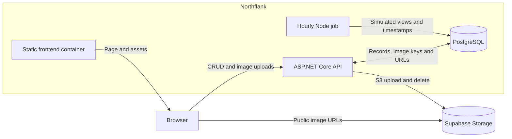

# Architecture

```mermaid
flowchart LR
    Browser[Browser]
    subgraph Northflank
        Frontend[Static frontend container]
        API[ASP.NET Core API]
        DB[(PostgreSQL)]
        Job[Hourly Node job]
    end
    Storage[(Supabase Storage)]
    Frontend -->|Page and assets| Browser
    Browser -->|CRUD and image uploads| API
    API <-->|Records, image keys and URLs| DB
    Job -->|Simulated views and timestamps| DB
    API -->|S3 upload and delete| Storage
    Browser -->|Public image URLs| Storage
```

The job runs independently of the API. Image bytes live in Supabase; PostgreSQL holds their URLs and cleanup keys. Credentials stay on the API and job services.
